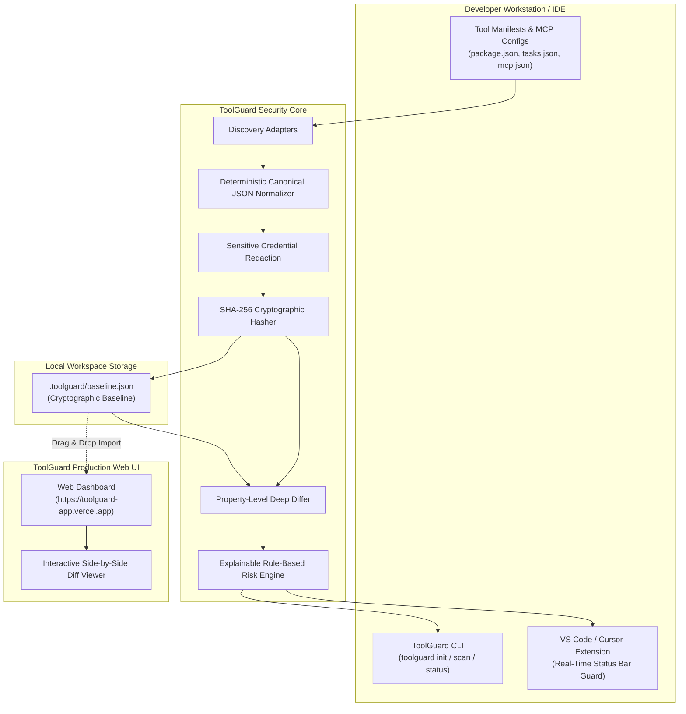

# 🛡️ ToolGuard

<div align="center">

> **"You trusted the tool. Did the tool stay the same?"**

[](https://github.com/Kaustubh-Barad-007/ToolGuard/actions)
[](LICENSE)
[](https://toolguard-app.vercel.app)
[](https://nodejs.org)
[](https://toolguard-app.vercel.app)

**Zero-Trust Capability Verification & Automated Trust Drift Detection for Developer Tools & AI Agents**

[Production Web Dashboard](https://toolguard-app.vercel.app) · [Report Issue](https://github.com/Kaustubh-Barad-007/ToolGuard/issues) · [Security Policy](SECURITY.md)

</div>

---

## 📌 Why ToolGuard?

Modern development environments and AI coding agents rely heavily on external tool definitions, Model Context Protocol (MCP) servers, npm build scripts, and plugin manifests. When you initially configure a tool, you review and trust its permissions.

Over time, dependencies update, configurations change, or supply-chain drift silently expands tool capabilities—granting unintended **network egress**, **arbitrary shell execution**, or **broad filesystem read/write privileges**.

**ToolGuard acts as Git for tool trust**:
1. **Discovers** tool manifests and developer script capabilities across your workspace.
2. **Freezes** them into a tamper-proof cryptographic baseline using deterministic SHA-256 fingerprinting.
3. **Monitors** and alerts you the instant any capability, endpoint, or permission drifts from the baseline.

---

## 💻 Exact Commands to Install & Connect Across ANY IDE

### 1. Universal CLI (Works for Any Editor: JetBrains, Neovim, Sublime, Terminal)

```bash
# Step 1: Install globally (1-line standalone binary, bundled dependencies)
npm install -g https://toolguard-app.vercel.app/toolguard.tgz

# Step 2: Initialize & freeze tool capabilities in your project folder
cd /path/to/your/project
toolguard init -y

# Step 3: Verify tools anytime against the SHA-256 baseline
toolguard scan

# Step 4: Disconnect / Purge baseline anytime
toolguard disconnect
```

### 2. VS Code, Cursor & Windsurf (1-Line Download & Install)

Run the single line corresponding to your editor in PowerShell (or Bash) to download the package directly from production and install it:

#### VS Code (PowerShell):
```powershell
curl.exe -LO https://toolguard-app.vercel.app/toolguard-vscode-1.0.0.vsix; code --install-extension toolguard-vscode-1.0.0.vsix
```

#### Cursor (PowerShell):
```powershell
curl.exe -LO https://toolguard-app.vercel.app/toolguard-vscode-1.0.0.vsix; cursor --install-extension toolguard-vscode-1.0.0.vsix
```

#### Windsurf (PowerShell):
```powershell
curl.exe -LO https://toolguard-app.vercel.app/toolguard-vscode-1.0.0.vsix; windsurf --install-extension toolguard-vscode-1.0.0.vsix
```

#### macOS / Linux (Bash):
```bash
curl -LO https://toolguard-app.vercel.app/toolguard-vscode-1.0.0.vsix && code --install-extension toolguard-vscode-1.0.0.vsix
```

> **Editor Status Bar Indicator**:
> - `🛡 ToolGuard ✓` — All workspace tools strictly match the trusted baseline.
> - `🛡 ToolGuard ⚠ DRIFT` — Immediate notification with 1-click inspection whenever unauthorized capability alterations occur.

### 3. Web Dashboard (Connect & Disconnect Online)

Live Dashboard: **[https://toolguard-app.vercel.app](https://toolguard-app.vercel.app)**

- **To Connect**: Drag and drop your project's `.toolguard/baseline.json` directly onto the dashboard.
- **To Disconnect**: Click the red **Disconnect** button in the top project banner to reset to a clean zero-project state.

---

## 🏛️ Architecture

ToolGuard operates with a **pure local-first, zero-telemetry architecture**. No source code or private tokens ever leave your workstation.



---

## 📦 Monorepo Structure

```text
ToolGuard/
├── .github/
│   └── workflows/
│       └── ci.yml             # Automated GitHub Actions CI & Verification Gate
├── apps/
│   ├── vscode-extension/      # Extension for VS Code, Cursor & Windsurf
│   └── web/                   # Modern React 18 + Vite + MUI Dashboard
├── packages/
│   ├── shared/                # Shared TypeScript types, schemas & constants
│   ├── core/                  # Core cryptographic hashing, normalizer & risk rules
│   └── cli/                   # Standalone terminal CLI executable
├── tests/                     # Vitest test suite (13/13 passing)
├── demo/                      # Deterministic evaluation test fixtures
├── scripts/                   # Local build helper scripts
├── package.json
├── pnpm-workspace.yaml
├── tsconfig.json
├── LICENSE                    # MIT License
├── CONTRIBUTING.md
├── SECURITY.md
└── README.md
```

---

## ⚡ 60-Second Evaluation Demo (Hackathon Judge Flow)

You can verify ToolGuard end-to-end in 60 seconds:

### Online (1-Click)
1. Open **[https://toolguard-app.vercel.app](https://toolguard-app.vercel.app)**.
2. Click the **⚡ Try Demo (1-Click)** button in the top bar.
3. Observe the immediate **Trust Drift Alert**: an unauthorized capability expansion (network egress & debug privileges) simulated on `npm:dev`.
4. Click **Inspect Raw Diff** to view the interactive side-by-side JSON comparison.
5. Click **Accept & Freeze New Baseline** to update the baseline hash and return to a protected status.

### In Terminal
```bash
# 1. Initialize baseline
toolguard init -y

# 2. Run scan — verifies safe baseline
toolguard scan

# 3. Simulate drift (e.g. modify package.json or .toolguard/tools/filesystem.json)
# 4. Re-scan — immediate drift detection with risk explanation
toolguard scan
```

---

## 🛡️ CI/CD Enforcement Gate

Integrate ToolGuard directly into your GitHub Actions pipeline to block pull requests that silently expand tool capabilities:

```yaml
- name: Verify Tool Capabilities
  run: |
    npm install -g https://toolguard-app.vercel.app/toolguard.tgz
    toolguard scan --ci --fail-on high
```

---

## 🔒 Privacy & Security Principles

- **Zero-Telemetry**: ToolGuard does not transmit source code, files, or telemetry to external servers.
- **Automatic Redaction**: Sensitive authorization headers and credentials (`apiKey`, `password`, `token`, `secret`) are masked with `[REDACTED]` prior to hashing.
- **Deterministic**: Tool normalizer sorts object keys and normalizes line endings, preventing false drift alerts caused by formatting differences.

---

## 📄 License

Distributed under the **MIT License**. See [`LICENSE`](LICENSE) for more information.
