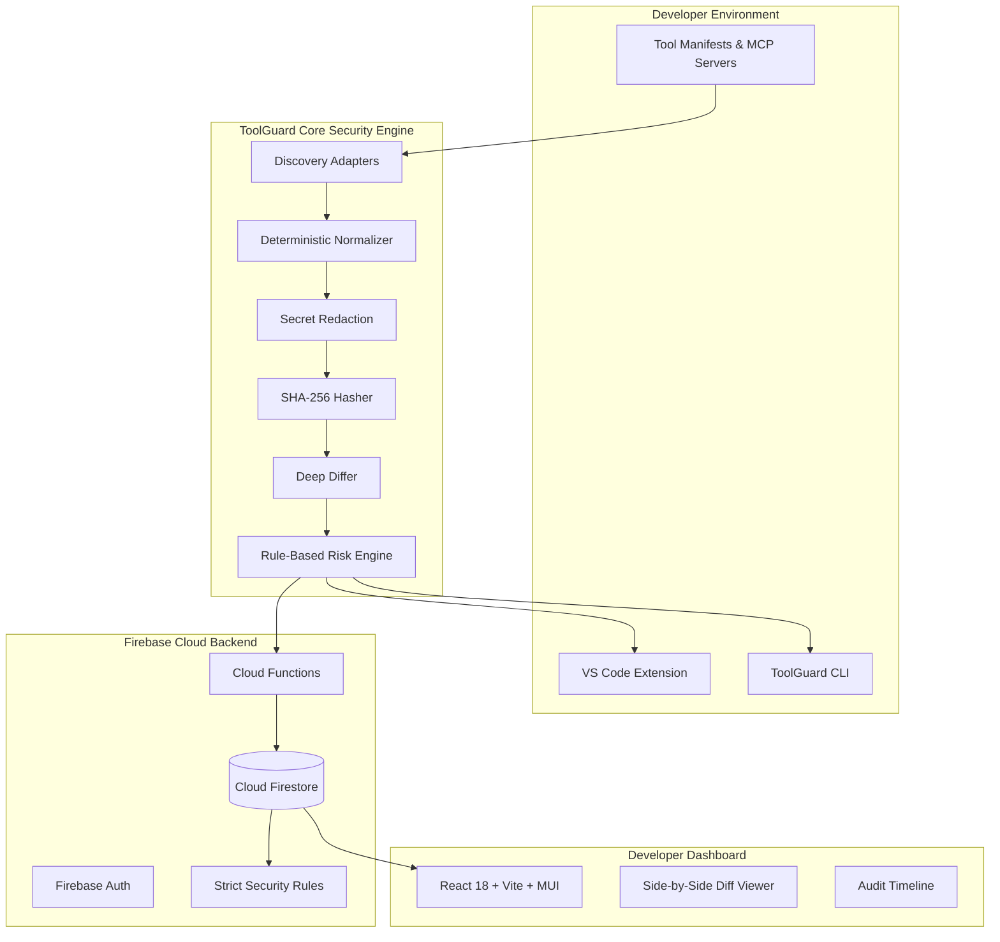

# ToolGuard

> **"You trusted the tool. Did the tool stay the same?"**

ToolGuard is a cybersecurity developer tool designed to detect **trust drift** in developer and AI tool definitions.

Modern AI agents and development environments rely heavily on external tool definitions, Model Context Protocol (MCP) servers, and plugin manifests. When you initially install or configure a tool, you review and trust its authorized capabilities. Over time, updates, configuration changes, or supply-chain drift can silently expand tool capabilities—introducing write permissions, shell execution, or remote endpoints without explicit consent.

ToolGuard acts as **Git for tool trust**: it freezes your verified tool definitions into a trusted baseline and alerts you the moment any capability shifts.

---

## Key Features

- **Deterministic Fingerprinting**: Canonical JSON serialization and SHA-256 digests ensure tamper-evident baselines.
- **Rule-Based Explainable Risk**: Zero black-box scoring. Every alert reports the exact changed property, risk severity, and a human-readable "Why This Matters" security justification.
- **Side-by-Side Diff Viewer**: Inspect property-level changes directly in the web dashboard or CLI.
- **Native VS Code Extension**: Status bar indicator (`🛡 ToolGuard ✓` / `ToolGuard !`), command palette shortcuts, and non-intrusive drift alerts.
- **Developer CLI**: Full terminal support for local scanning (`toolguard scan`) and CI/CD pipelines (`toolguard scan --ci --fail-on high`).
- **Privacy by Design**: Zero source code uploaded; sensitive credential properties (`apiKey`, `password`, `token`) are automatically redacted with `[REDACTED]`.
- **Audit Timeline**: Immutable chronological ledger tracking every baseline creation, scan, and accepted change.

---

## Architecture



---

## Monorepo Layout

```text
ToolGuard/
├── apps/
│   ├── web/                    # React 18 + Vite + Material UI (MUI) Dashboard
│   └── vscode-extension/       # VS Code Extension with Status Bar & Diff QuickPick
├── packages/
│   ├── shared/                 # Shared types, Zod schemas, constants
│   ├── core/                   # Pure security engine (normalization, diff, risk rules)
│   └── cli/                    # CLI executable (init, scan, status, baseline, explain)
├── functions/                  # Firebase Cloud Functions (v2)
├── firebase/                   # firestore.rules, firestore.indexes.json, firebase.json
├── demo/                       # Deterministic judge demo test fixtures
└── tests/                      # Vitest unit & integration test suite
```

---

## Quick Start

### 1. Install Dependencies
```bash
pnpm install
```

### 2. Build the Monorepo
```bash
pnpm build
```

### 3. Run Unit & Integration Tests
```bash
pnpm test
```

### 4. Start the Web Dashboard
```bash
pnpm web:dev
```
Open `http://localhost:5173` to explore the dashboard. For hackathon evaluation, the application includes a **Judge Demo Scenario** with pre-configured tools displaying real-time drift detection.

---

## CLI Usage

```bash
# Initialize ToolGuard in your workspace and create baseline
pnpm --filter @toolguard/cli dev init

# Run security scan against baseline
pnpm --filter @toolguard/cli dev scan

# Inspect protection status
pnpm --filter @toolguard/cli dev status

# Explain drift and security implications for a specific tool
pnpm --filter @toolguard/cli dev explain project-files

# Open the web dashboard
pnpm --filter @toolguard/cli dev dashboard

# Run in CI/CD pipeline (fails build if high risk drift is detected)
pnpm --filter @toolguard/cli dev scan --ci --fail-on high
```

---

## VS Code Extension

1. Build the extension:
   ```bash
   cd apps/vscode-extension
   pnpm run build
   ```
2. Press `F5` in VS Code to launch the Extension Development Host.
3. Observe the status bar item: `🛡 ToolGuard ✓`.
4. Run commands via the Command Palette (`Ctrl+Shift+P` / `Cmd+Shift+P`):
   - `ToolGuard: Scan Project`
   - `ToolGuard: Create Trusted Baseline`
   - `ToolGuard: View Trust Drift`
   - `ToolGuard: Explain Drift`
   - `ToolGuard: Open Dashboard`

---

## Deterministic Demo Scenario (Judge Flow)

You can demonstrate ToolGuard end-to-end in 60 seconds:

1. Copy baseline tool `demo/project-files-v1.json` to `.toolguard/tools/project-files.json` (`read` only).
2. Run `toolguard scan` → Shows `✓ All monitored tools match trusted baseline. (SAFE)`.
3. Copy drifted tool `demo/project-files-v2.json` to `.toolguard/tools/project-files.json` (`read` + `write`).
4. Run `toolguard scan` →
   ```text
   Trust drift detected.

   project-files
     permissions: ["read"] → ["read", "write"]
     Risk: HIGH RISK

   Run:
     toolguard explain project-files
   ```
5. Run `toolguard explain project-files` → Outputs detailed explanation of write elevation risks.
6. Open Web Dashboard (`/tools/project-files`) → Inspect side-by-side diff, click `[Accept Change]`, and verify the new baseline version and audit trail.

---

## Security & Limitations

ToolGuard is purpose-built to detect unauthorized or unexpected modifications to trusted tool configurations.
- It does not guarantee that a baseline tool is inherently free of vulnerabilities.
- It does not replace runtime process sandboxing or code review.
- It provides transparent, explainable alerts so developers can make informed decisions before running altered tools.

---

## License
MIT License
