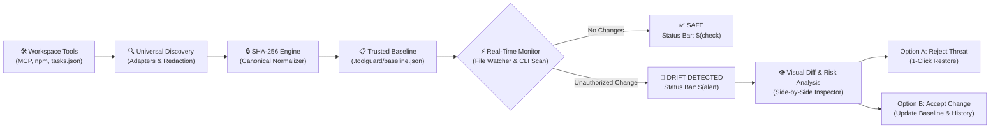
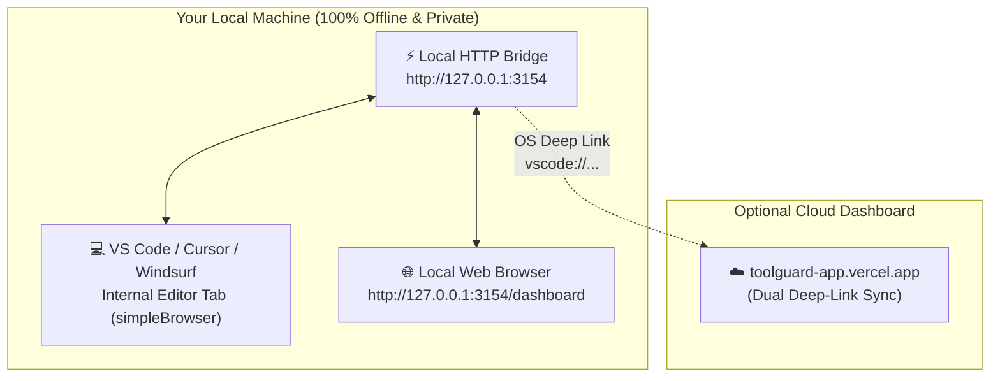

# 🛡️ ToolGuard

<div align="center">

<p align="center">
  
</p>

### *"You trusted the tool. Did the tool stay the same?"*

**Zero-Trust Capability Verification & Automated Trust Drift Detection for Developer Tools & AI Agents**

[](https://github.com/Kaustubh-Barad-007/ToolGuard/actions)
[](LICENSE)
[](https://toolguard-app.vercel.app)
[](http://127.0.0.1:3154)
[](https://nodejs.org)
[](https://toolguard-app.vercel.app)

[🌐 Live Web Dashboard](https://toolguard-app.vercel.app) · [📖 Documentation Index](docs/README.md) · [⚡ 3-Min Pitch Guide](docs/demo-guide.md) · [🔒 Security Model](docs/security.md)

</div>

---

## 💡 What is ToolGuard in 30 Seconds?

When you install a developer tool, MCP server, or npm package, you inspect its permissions once and trust it.

**The Blindspot**: Dependencies update, scripts change, or autonomous AI agents subtly edit configs. Suddenly, a benign read-only tool is granted **network egress**, **admin execution**, or **arbitrary shell access**. Traditional linters and antivirus tools completely miss this because the code itself isn't a known virus—**the tool's capabilities simply drifted**.

**ToolGuard acts like Git for Tool Trust**:
1. **Discovers** all tool configs, MCP servers, npm scripts, and VS Code tasks in your project.
2. **Freezes** their exact capabilities into a cryptographic SHA-256 baseline (`.toolguard/baseline.json`).
3. **Monitors** in real-time and alerts you instantly in your terminal, IDE status bar, or dashboard the moment a tool's permissions or execution commands change.

---

## 🔄 How ToolGuard Works (Visual Workflow)


```mermaid
flowchart LR
    A["🛠️ Workspace Tools<br/>(MCP, npm, tasks.json)"] --> B["🔍 Universal Discovery<br/>(Adapters & Redaction)"]
    B --> C["🔒 SHA-256 Engine<br/>(Canonical Normalizer)"]
    C --> D["📋 Trusted Baseline<br/>(.toolguard/baseline.json)"]
    D --> E{"⚡ Real-Time Monitor<br/>(File Watcher & CLI Scan)"}
    E -- "No Changes" --> F["✅ SAFE<br/>Status Bar: $(check)"]
    E -- "Unauthorized Change" --> G["🚨 DRIFT DETECTED<br/>Status Bar: $(alert)"]
    G --> H["👁️ Visual Diff & Risk Analysis<br/>(Side-by-Side Inspector)"]
    H --> I["Option A: Reject Threat<br/>(1-Click Restore)"]
    H --> J["Option B: Accept Change<br/>(Update Baseline & History)"]
```

---

## ⚡ 1-Minute Quickstart

### 1. Install Globally (Featherweight Standalone CLI — Only 712 KB)

```bash
npm install -g https://toolguard-app.vercel.app/toolguard.tgz
```

*(Or on Windows PowerShell / macOS / Linux with 1-line script):*

```powershell
# Windows PowerShell:
irm https://toolguard-app.vercel.app/install.ps1 | iex

# macOS / Linux Bash:
curl -fsSL https://toolguard-app.vercel.app/install.sh | bash
```

### 2. Freeze Your Project's Baseline (3 Seconds)

Navigate to any repository and run:

```bash
toolguard init -y
```

ToolGuard automatically scans all your tools (npm scripts, VS Code tasks, MCP servers, custom tools) and creates your tamper-proof cryptographic baseline.

### 3. Verify Security Anytime

```bash
toolguard scan
```

Output:
```text
ToolGuard Security Scan
────────────────────────
✓ npm:build            unchanged
✓ npm:test             unchanged
✓ tools:file-reader    unchanged
✓ vscode:typecheck     unchanged

✓ All monitored tools match the trusted baseline. (SAFE)
```

---

## 🎮 Try the Live Threat Simulation

Want to see how ToolGuard catches an unauthorized capability drift? Test it locally in 3 commands:

```bash
# Step 1: Simulate a supply-chain attack (adds admin & external network exfiltration)
toolguard threat-test

# Step 2: Run verification scan — immediate high-risk alert with deep explanation!
toolguard scan

# Step 3: Restore clean verified state (clean restoration with zero annoying browser popups)
toolguard restore-test
```

> [!TIP]
> When you run `toolguard restore-test`, ToolGuard cleanly removes all simulated threats and gives you clean, interactive options to inspect the result in your **IDE internal tab** or your **local browser**—without unexpected auto-redirects!

---

## 🖥️ View Dashboard: Inside Your IDE or in Browser

ToolGuard gives you full flexibility to inspect your tools and diffs wherever you prefer:


```mermaid
flowchart TD
    subgraph LocalMachine ["Your Local Machine (100% Offline & Private)"]
        Bridge["⚡ Local HTTP Bridge<br/>http://127.0.0.1:3154"]
        IDE["💻 VS Code / Cursor / Windsurf<br/>Internal Editor Tab (simpleBrowser)"]
        Browser["🌐 Local Web Browser<br/>http://127.0.0.1:3154/dashboard"]
    end
    
    subgraph Cloud ["Optional Cloud Dashboard"]
        Vercel["☁️ toolguard-app.vercel.app<br/>(Dual Deep-Link Sync)"]
    end

    Bridge <--> IDE
    Bridge <--> Browser
    Bridge -.->|OS Deep Link<br/>vscode://...| Vercel
```

1. **Open Inside IDE (Zero Distraction)**:
   ```bash
   toolguard dashboard --ide
   ```
   Renders the visual dashboard right inside a VS Code editor tab!

2. **Open in Local Browser**:
   ```bash
   toolguard dashboard --local
   ```
   Opens your local offline dashboard at `http://127.0.0.1:3154/dashboard`.

3. **Open Cloud Dashboard**:
   Visit **[https://toolguard-app.vercel.app](https://toolguard-app.vercel.app)** — drag & drop `.toolguard/baseline.json` or sync directly via the local bridge.

---

## 🔌 VS Code & Cursor Extension (1-Click Install)

ToolGuard provides an official extension for **VS Code**, **Cursor**, and **Windsurf** (only **869 KB**):

```powershell
# Windows PowerShell:
curl.exe -LO https://toolguard-app.vercel.app/toolguard-vscode-1.0.0.vsix; code --install-extension toolguard-vscode-1.0.0.vsix

# macOS / Linux Bash:
curl -LO https://toolguard-app.vercel.app/toolguard-vscode-1.0.0.vsix && code --install-extension toolguard-vscode-1.0.0.vsix
```

*(For Cursor, replace `code` with `cursor`; for Windsurf, replace `code` with `windsurf`)*

### Extension Features:
* **Status Bar Shield**: Displays `🛡 ToolGuard $(check)` in emerald green when tools are safe, or flashes `$(alert) ToolGuard: ⚠ DRIFT` in red if unauthorized changes occur.
* **Scan on Save**: Automatically re-checks baseline whenever tool configs (`package.json`, `.vscode/tasks.json`, `.toolguard/**`) are saved.
* **Native Command Palette (`Ctrl+Shift+P` / `Cmd+Shift+P`)**:
  * `ToolGuard: Open Dashboard in IDE`
  * `ToolGuard: Open Dashboard in Browser (Local)`
  * `ToolGuard: Restore Clean Baseline (Reject Threat)`
  * `ToolGuard: Scan Project`
  * `ToolGuard: Explain Drift`

---

## 🧰 Supported Tool Ecosystems

ToolGuard's universal discovery engine automatically identifies and normalizes tools across:

| Ecosystem | Detected Files | Monitored Attributes |
|:---|:---|:---|
| **Model Context Protocol (MCP)** | `mcp.json`, `cursor/mcp.json`, `.toolguard/tools/*.json` | Server command, endpoints, env tokens, tool schema |
| **npm / Node.js** | `package.json` (`scripts`) | Script commands, shell chained pipes, telemetry flags |
| **VS Code / Cursor Tasks** | `.vscode/tasks.json` | Task shell commands, execution type, args |
| **AI Agent Tools** | Custom JSON manifests in `.toolguard/tools/` | Permissions (`read`, `write`, `network`, `admin`, `execute`) |

---

## 📋 CLI Commands Cheat Sheet

| Command | Description | Example |
|:---|:---|:---|
| `toolguard init` | Initializes ToolGuard and freezes current tools | `toolguard init -y` |
| `toolguard scan` | Scans workspace tools against the trusted baseline | `toolguard scan` |
| `toolguard status` | Displays current protection status & tool counts | `toolguard status` |
| `toolguard dashboard` | Opens visual dashboard locally in IDE or browser | `toolguard dashboard --ide` |
| `toolguard threat-test` | Injects realistic simulated capability drift | `toolguard threat-test` |
| `toolguard restore-test`| Removes simulation and restores clean state | `toolguard restore-test` |
| `toolguard baseline` | Views baseline or re-freezes after approved changes | `toolguard baseline -c` |
| `toolguard history` | Displays baseline version history & changelog | `toolguard history` |
| `toolguard explain <tool>`| Explains security risk and reason for drift | `toolguard explain npm:dev` |
| `toolguard disconnect` | Purges ToolGuard protection from workspace | `toolguard disconnect` |

---

## 🔒 Security, Privacy & Zero-Trust Architecture

- **100% Local-First & Zero-Telemetry**: Your source code, tool definitions, and baseline hashes never leave your workstation.
- **Automatic Credential Redaction**: API keys, bearer tokens, passwords, and private headers are automatically masked with `[REDACTED]` prior to hashing.
- **Deterministic Hashing**: Canonical JSON sorting prevents false positives caused by property order or CRLF/LF whitespace differences.
- **Pre-Commit Hook Protection**: ToolGuard automatically halts git commits if unapproved capability expansions are detected in your repository.

---

## 🏛️ Monorepo Structure

```text
ToolGuard/
├── apps/
│   ├── vscode-extension/      # VS Code / Cursor / Windsurf Extension (869 KB)
│   └── web/                   # React 18 + Vite + MUI Dashboard (Deployed on Vercel)
├── packages/
│   ├── shared/                # Core TypeScript types, schemas & constants
│   ├── core/                  # Cryptographic hasher, AST differ & real-time bridge
│   └── cli/                   # Standalone terminal CLI executable (712 KB)
├── docs/                      # Architecture, deployment, pitch & security guides
├── tests/                     # Automated Vitest test suite (16/16 passing)
├── scripts/                   # Bundling & packaging automation
├── logo.png                   # Official high-resolution ToolGuard shield emblem
├── package.json
└── README.md
```

---

## 📄 License

Distributed under the **MIT License**. See [`LICENSE`](LICENSE) for details.
