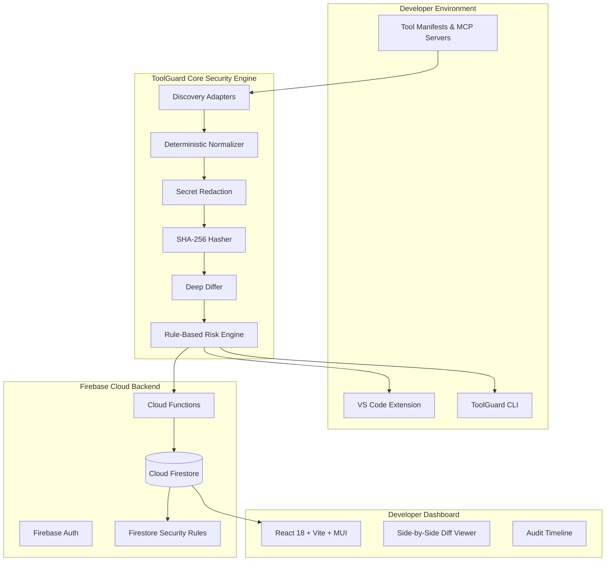

# ToolGuard Architecture

ToolGuard is engineered as a modular, production-ready developer security system designed to detect **Trust Drift** in AI and developer tool configurations.

## Core Modules

1. **`@toolguard/shared`**: Defines centralized Zod schemas, TypeScript types, risk rule enumerations, and error codes.
2. **`@toolguard/core`**: Independent, pure security engine containing:
   - Pluggable discovery adapters (`GenericJsonAdapter`, `McpToolAdapter`).
   - Normalization with deterministic sorting for unordered permission sets.
   - SHA-256 canonical hashing.
   - Property-level AST differ.
   - Explainable, transparent rule-based risk evaluation.
   - Heuristic credential redaction (`[REDACTED]`).
   - Baseline lifecycle manager.
3. **`@toolguard/cli`**: Node.js/TypeScript command line executable (`init`, `scan`, `status`, `baseline`, `explain`, `dashboard`).
4. **`@toolguard/web`**: Material UI developer dashboard with side-by-side diff viewer, audit timeline, and demo environment toggle.
5. **`apps/vscode-extension`**: Native VS Code status bar item, command palette actions, file watcher, and non-intrusive drift alerts.
6. **`functions`**: Firebase Cloud Functions (v2) with strict schema validation and immutable audit logging.
